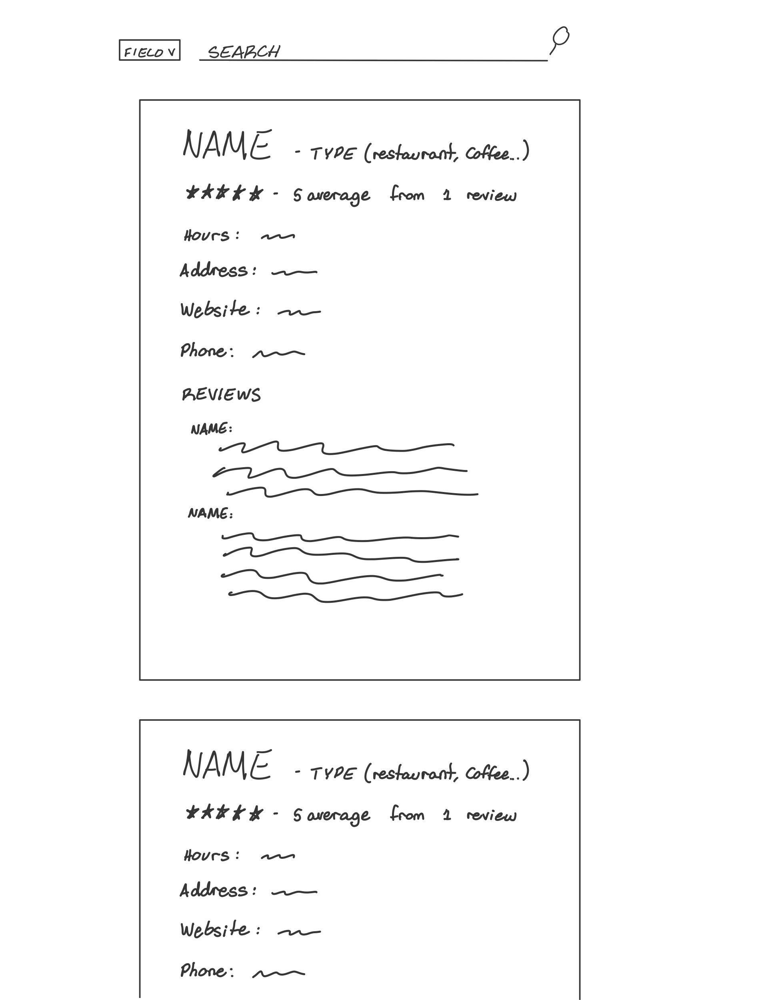
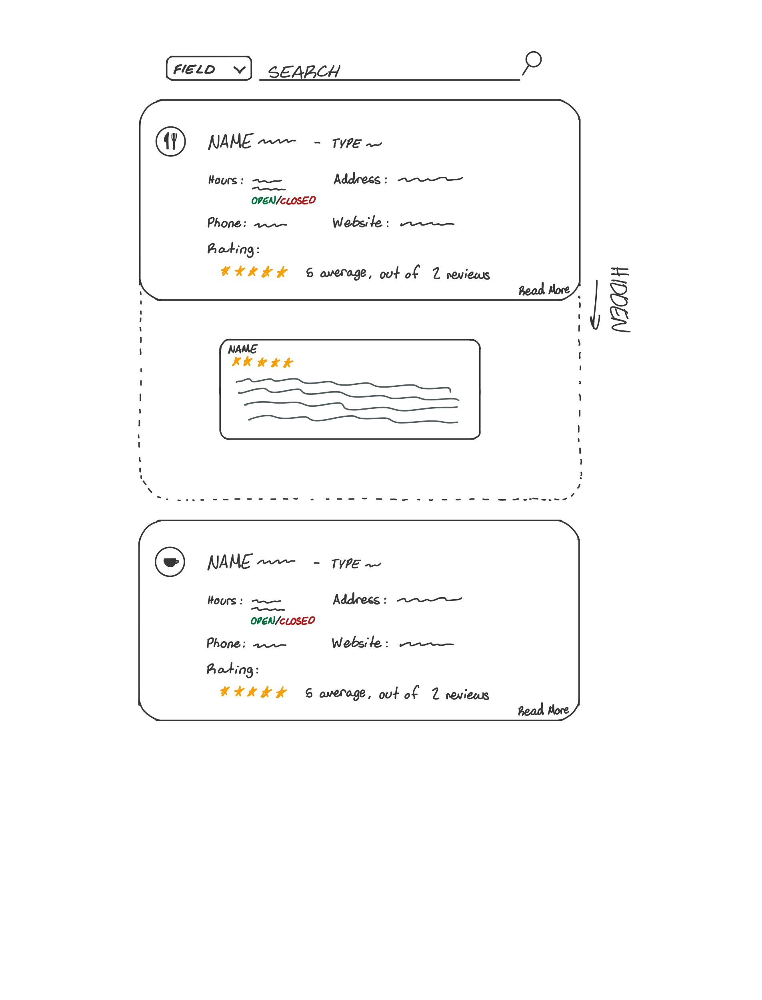

# Project 2: Design Journey

Be clear and concise in your writing. Bullets points are encouraged.

**Everything, including images, must be visible in VS Code's Markdown Preview.** If it's not visible in Markdown Preview, then we won't grade it.

## Catalog (Milestone 1)

### Describe your Catalog (Milestone 1)
> What will your collection be about? What types of attributes will you keep track of for the *things* in your catalog? 1-2 sentences.
My collection of data will be about nearby eateries in Ithaca: cafes, restaurants, bakeries, bar, etc...\
Attributes: Name, Type of Food, Price ($ $$ $$$), Location (address), Hours, Phone Number, Website Link, Type (cafe, restaurant, etc...), Reviews, Star Rating (Might not be able to implement this but we'll see)


### Target Audience(s) (Milestone 1)
> Tell us about your target audience(s).
Phillip:
- Phillip is a new commer to Ithaca. He needs to find a place that sells south-western type food becuase he is homesick.
- Price isn't too much of a concern, but he doesn't want to splurg.
- The address needs to be visible and copyable so he can put it into a gps and go there (be great if I can make a link to send him to a google maps thing)
- He wants something relatively authentic so something with pretty good reviews and ratings


### Design Patterns (Milestone 1)
> Review some existing catalog that are similar to yours. List the catalog's you reviewed here. Write a small reflection on how you might use the design patterns you identified in your review in your own catalog.

Google Search, "Eateries Near Me",
- Stacked List Blocks
    - Features by order of heirarchy
        - Name of restaurant
        - Star Rating (#of ratings)
        - Price Rating ($ $$ $$$)
        - Type of Food (default=restaurant)
        - Square image of the place
        - Address
        - Open or Closed & hours
        - Sometimes: Description of the place
- When clicked
    - More information came out in a large block to the side of the stacked list blocks
    - Website, Hours, Menu, Reservations, Ordering, Phone Number
    - Reviews when user scrolls down


Eatery App
- Title Bar
- Search Bar "Search Eateries and Menus"
- Two Lists, Open and Closed
- Open
    - Stacked List Block
        - Features by order of heirarchy
            - Img of the place
            - Title
            - Distance from the user
            - Tags, (meal plan, BRBs, Cash)
            - Open until $time
- Closed
    - Same as open
    - all list blocks are given an opaque layer on top of them
- All are clickable
    - Same preview information at the top
    - Popular Times diagram with waiting times depending on the hour
    - Menu (breakdast, lunch dinner)

What I can use
- Both have stackable blocks, so I don't think grid is a good option for me
- I didn't like when the image was too important in the heirarchy of the block
    - Title, Food Type and Star Rating should be the most important
    - Then address
    - Then image (in my case icon for the type)
    - On click, same info but add...
        - website
        - description
        - reviews with star rating


## Design & Planning (Milestone 2)

## Design Process (Milestone 2)
> Document your design process. Show us the evolution of your design from your first idea (sketch) to design you wish to implement (sketch). Show us the process you used to organize content and plan the navigation, if applicable.
> Label all images. All labels must be visible in VS Code's Markdown Preview.
> Clearly label the final design.


First Sketch:
\
Final Sketch:


Process:\
I first thought that the eatery card should have the star rating high in the heirarchy of the card. This didn't really work well, becuase (1) I wouldn't be able to expand to see reviews in a comfortable way and (2) it's not the most important thing a user wants to see.\
A user wants to first see the name, the type of shop, the hours and the address. The rest is extra information that could be useful in picking a place, but is not imperative.\
I therefore redesigned the first sketch to put the layout in this order of heirarchy. Name and type on top, with an icon that can help identify quicker. Hours, Address, and below them, phone and website. Finally, put the rating and the read more input that expands the card to see reviews.

## Partials (Milestone 2)
> If you have any partials, plan them here.


## Database Schema (Milestone 2)
> Describe the structure of your database. You may use words or a picture. A bulleted list is probably the simplest way to do this. Make sure you include constraints for each field.

Table: movies
- field 1: description..., constraints...
- field...

eateries {
    id: INTEGER NN PK AI U;
    type: TEXT NN; //this will be restaurant, coffee-shop, deli, etc..
    name: TEXT NN;
    hours: TEXT NN;
    address: TEXT NN;
    website: TEXT;
    phone: TEXT;
    star_rating: REAL NN;
    number_reviews: INTEGER NN;
    food_type: TEXT NN //ex. pho noodles
    price = TEXT NN; //ex. $ $$ $$$
}

reviews {
    id: INTEGER NN PK AI U;
    eatery_id: INTEGER NN; //this will be the id of the eatery
    name: TEXT; //can be anonymous
    review: TEXT NN;
    star_rating: REAL NN;
}


## Database Query Plan (Milestone 2)
> Plan your database queries. You may use natural language, pseudocode, or SQL.]

This is my first draft Milestone 2 plan

1. All records

    ```sqlite3
        SELECT * FROM eateries;
        //insert some code that makes :parent_id = "eatery's id";
        SELECT name, review, star_rating FROM reviews WHERE parent_id = :parent_id;
    ```

2. Search records
    ```sqlite3
        SELECT * FROM eateries WHERE type = :searchField AND name = :seach;
        //insert some code that makes :parent_id = "eatery's id";
        SELECT name, review, star_rating FROM reviews WHERE parent_id = :parent_id;
    ```

3. Insert record
    ```sqlite3
        //We have the id of the parent eatery = :parent_id
        //Creating a new review
        INSERT INTO reviews (parent_id, name, review, star_rating) VALUES (:parent_id, :name, :review, :star_rating)

        //Updating number of reviews in an eatery
        UPDATE eateries SET number_reviews = number_reviews + 1 WHERE id = :parent_id;
    ```

\
Now that I've implemented it, I realized I've missed some things\
Here's the updated plan.

1. All records

    ```sqlite3
        SELECT * FROM eateries;

        \\Then to output both tables...
        for every eatery in eateries {
            append reviews with parent_id = :parent_id to eatery \\:parent_id = eatery["id"]
        }
    ```
    The reason for this change...
    - I realized that I would need to cycle through the eateries to append the reviews to the end of the array of the eatery. I therefore call the sql query inside the for loop of eateries.
    - This also allows me to have a search that changes the eateries in the list and then I only need to append the reviews for the given eateries in the list.

2. Search records
    ```sqlite3
        This is for wild card search where field isn't applied:

        SELECT * FROM eateries WHERE
            name like '%'||:search||'%' or
            type like '%'||:search||'%' or
            food_type like '%'||:search||'%' or
            hours_open like '%'||:search||'%' or
            hours_close like '%'||:search||'%' or
            address like '%'||:search||'%' or
            website like '%'||:search||'%' or
            phone like '%'||:search||'%' or
            price = :search or
            star_rating like '%'||:search||'%'

        When field IS applied:

        SELECT * FROM eateries WHERE " . $search_field . " like '%'||:search||'%'
    ```
    The reason for this change...
    - I was originally only searching by name when the field isn't chosen, but I realized the assignment wanted every field to be searchable. Therefore I made the wild card search at the top where it checks every field for entries containing the searched parameter.
    - The field one stays pretty similar, but it uses "like" instead of =, so that the search is more accessible

3. Insert record
    ```sqlite3
        //We have the id of the parent eatery = :parent_id
        //We get this through the form id that is unique to each eatery card
        //Creating a new review

        INSERT INTO reviews (parent_id, name, review, review_star_rating) VALUES (:parent_id, :name, :review, :review_star_rating)

        ADDED...
        //Update the star rating and number_reviews

        SELECT star_rating, number_reviews FROM eatery WHERE id = :id //:id = :parent_id

        //Do some magic math
        //$star_rating = (($star_rating * $number_reviews) + review_star_rating) / ($number_reviews + 1)
        //$number_reviews += 1

        "UPDATE eateries SET number_reviews = " . $number_reviews . ", star_rating = " . $star_rating . " WHERE id = :id"
        //It's okay to use the . to join strings and the var values as they are safe values. They are not text and the input is completely controlled/restricted to safe values. Additionally, the number_reviews is never touched by the user.
    ```

## Code Planning (Milestone 2)
> Plan any PHP code you'll need here.

THIS IS THE INITIAL PLAN...

pseudo:

```
    call db and get eatery info

    for every eatery in eateries{
        $review = sql query WHERE eatery_id = eatery["id"]
        star_rating = 0;
        for every review in $reviews {
            star_rating += 1
            update eatery database --> number_reviews = number_reviews + 1
        }
        if length($reviews) !== 0 {
            star_rating = star_rating / length($reviews);
        } else {
            star_rating = 5;
        }

        update eatery databse -->  star_rating = $star_rating;

        append reviews at the end of eatery array
        // eatery = array (info..., ["reviews] => array(review info...))
    }

    call db and get eatery info

    for every eatery in eateries {
        append reviews at the end of eatery array
        // eatery = array (info..., ["reviews] => array(review info...))
    }

    function review_card ($review) {
        html shtuff with $review info...
    }

    function eatery_card ($eatery){
        bunch of html that formats the info from $eatery array...
        for every review in $eatery["reviews] {
            function review_card(review)
        }
    }
```

THIS IS A REFINED PLAN...

```
    if $_POST is add an eatery {
      valid = TRUE

      if name empty {
          valid = FALSE
      } else {
          if invalid using regex{
              valid = FALSE
          }
      }

      if type empty { //restaurant, deli...
          valid = FALSE
      } else {
          if invalid using regex{
              valid = FALSE
          }
      }

      if food_type empty { //desc of the food "genre"
          valid = FALSE
      } else {
          if invalid using regex{
              valid = FALSE
          }
      }

      if price_rating empty {
          valid = FALSE
      }

      if address empty {
          valid = FALSE
      } else {
          filter var FILTER_SANITIZE_STRING
      }

      if hours_open empty {
          valid = FALSE
      }

      if hours_close empty {
          valid = FALSE
      }

      if website not empty {
          filter var FILTER_SANITIZE_URL
      }

      if !pregmatch("regex", $phone) {
          valid = FALSE
      }

      if valid {
        insert data into new record of eatery
        call db and get all the eateries
      }
    }

    if $_POST is review { //So the review form is submitted
      //filter input for review
      valid = TRUE
      id = element div.eatery id

      if star_rating empty {
          valid = FALSE
      }

      if valid {
          update the star_rating and the number_reviews from parent eatery with the query and code made above in the query planning
          call db and get all eateries
      }
    }


    REMOVED
    //for every eatery in eateries{
    //   $review = sql query WHERE eatery_id = eatery["id"]
    //    star_rating = 0;
    //    for every review in $reviews {
    //        star_rating += 1
    //        update eatery database --> number_reviews = number_reviews + 1
    //    }
    //    if length($reviews) !== 0 {
    //        star_rating = star_rating / length($reviews);
    //    } else {
    //        star_rating = 5;
    //    }
    //
    //    update eatery databse -->  star_rating = $star_rating;
    //
    //   append reviews at the end of eatery array
    //    // eatery = array (info..., ["reviews] => array(review info...))
    }

    if $_POST is search {
      if (if search field isn't empty and isn't "none" or "") {
        search_sql = "//a wild card search in that field//"
        if (search_field == "price") {
          //dont do a wild card search
          // If wild card, a search = "$" would show results of "$",
          //"$$", and "$$$", when we only want the first version.
          //So...
          search_sql = "... WHERE price = :search"
          // no '%' in the sql
        }
        if (search is empty) {
          search_sql = "//select all eateries//"
        }
      } else if (search_field is "none" or "") {
        search_sql = "//wild card search from all fields with 'or' between each bool//"
      } else if (search field is empty) {
        search_sql = "get all the eateries"
      }

      //now fetch the eateries with the sql string
      $eateries = array of all the eateries from the sql query

      if ($eateries is empty) {
        $eateries = sql query getting ALL the eateries
        $empty = TRUE
        //show message that there were no eateries with that search with
        //the $empty variable and also get all the eateries to show the
        //user what's there
      }
    }

    call db and get eatery info

    for every eatery in eateries {
        append reviews at the end of eatery array
        // eatery = array (info..., ["reviews] => array(review info...))
        // nested arrays
    }

    function review_card ($review) {
        html shtuff with $review info...
    }

    function eatery_card ($eatery){
        bunch of html that formats the info from $eatery array...
        for every review in $eatery["reviews] {
            function review_card(review)
        }
    }
```


# Reflection (Final Submission)
> Take this time to reflect on what you learned during this assignment. How have you improved since Project 1? What things did you have trouble with?

I thought my design and ease of use was much better this time around. I believe that the goal of having a easially accessible and understandable design was achieved. I faced a couple challenges along the way... I had to redesign my entire php code because I messed up the requirements. I thought that I could have two tables, but the syllabus said specifically to have one. So, I had to remove a table and redesign my php many times. The final design is written in the desing-journey, along with everything else. I also had a lot of trouble with the data standardization of my database. I was unsure of the formats I wanted to accept in my inputs and how to escape them into my website properly. Overall, I am happy with my website and the amount I learned about two table manipulation (even though accidentally) and data management.
